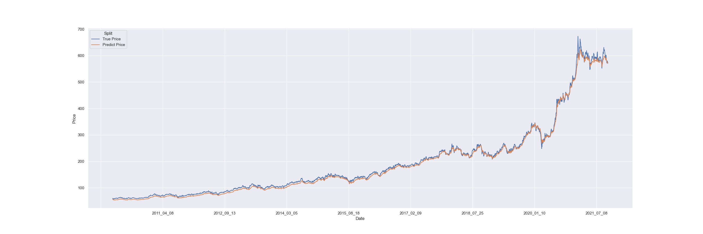
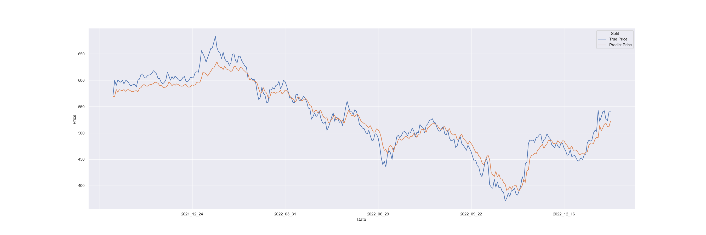

# TWStock Price Predictor
A tool which predicts twstock price by using deep learning techniques.

## Demo
I predict 2330 as an example. I fetch the closing stock price from 2010 and split 90% as training, 10% as validation.

The following two figures are the predicted stock prices for training and validation.
| Training | Validation |
| --- | --- |
|  |  |

For testing, I use recently 20 days to predict future 5 days trend. The following figure is a demo.


## How to run
1. Install `pipenv` (if not install yet): `$ pip install --user pipenv`
2. Install required package: `$ pipenv install`
3. Activate the python environment: `$ pipenv shell`
4. Fetch data (takes a long time): `$ make fetch-data`
5. Train model, test model, and visualize result: `$ make all`

# Reference
Codes for fetching Taiwan stock prices (in `src/twstock/`) are from the following repository.
```
@misc{mlouielu,
  author = {Louie Lu},
  title = {twstock},
  year = {2021},
  publisher = {GitHub},
  journal = {GitHub repository},
  howpublished = {\url{https://github.com/mlouielu/twstock}},
  commit = {bcd9b022aeb858549992b1251151c741e0c22d80}
}
```
